# DB实验1
**本次实验在java + jdbc拼sql完成实验中的导入部分，在索引部分使用命令行排除jdbc的干扰和可能的优化[项目地址](https://github.com/Pypy233/DB2)，截图为在mac OSX 16G环境下的运行时间**
## 步骤二
jdbc直接从txt导入到数据库表，对应语句

	 private static String LOAD_ORDERS_DATA =
            "load data local infile \"/Users/py/Downloads/索引作业数据/data1.txt\"\n" +
            "into table orders(id, name, age, sex, amount);";

    private static String LOAD_PRODUCTS_DATA =
            "load data local infile \"/Users/py/Downloads/索引作业数据/data2.txt\"\n" +
            "into table products(id, pid, nums);";

	private void loadOrdersData() {
	        try {
	            Statement statement = connection.createStatement();
	            long startTime=System.currentTimeMillis();
	            statement.execute(LOAD_ORDERS_DATA);
	            long endTime=System.currentTimeMillis();
	            System.out.println("Load orders data costs: " + (endTime - startTime)/1000 + " s.");
	        }catch (Exception ex) {
	            ex.printStackTrace();
	        }
	    }

    private void loadProductsData() {
        try {
            Statement statement = connection.createStatement();
            long startTime=System.currentTimeMillis();
            statement.execute(LOAD_PRODUCTS_DATA);
            long endTime=System.currentTimeMillis();
            System.out.println("Load products data costs: " + (endTime - startTime)/1000 + " s.");
        }catch (Exception ex) {
            ex.printStackTrace();
        }
    }

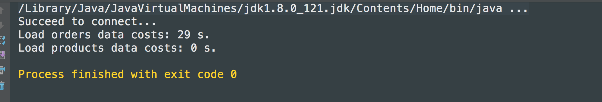

## 步骤三
### 问题1:在 orders 表中找出购买人年龄小于20岁的order列表。

未加入索引前sql语句:
		
		select * from orders where age < 20

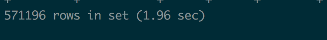
	
加入索引:
		
		create index age_idx on orders(age)
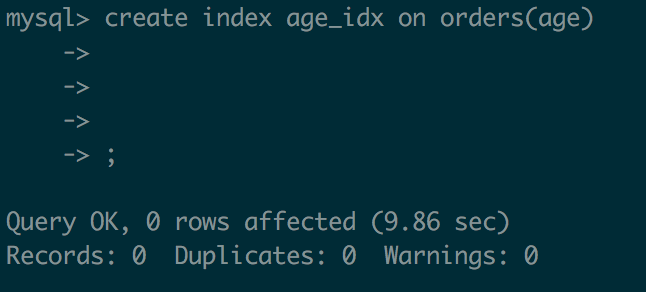
再次执行查询:

		select * from orders where age < 20
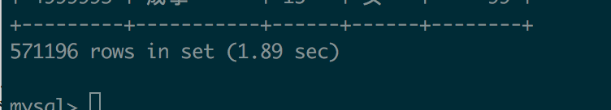		

**发现在age列建立B+树索引并没有对查询效率有明显帮助**
	  
	explain select * from orders where age < 20;
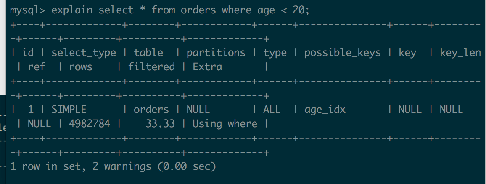

发现这依旧是一个全表查询，type为ALL

究其原因在查询过程中集合index value的大小十分重要，总结来说是当列越长，越少的值能被放入B+树的结点，因此树的深度会变大，当树的深度越大时，需要更多磁盘访问，磁盘访问越多效率越低

这是援引ovasitariq的一则回答翻译理解过来

在这个例子中，age列集合显然不会超过200与整个order表无法相比，此时磁盘开销巨大，需要更多的索引，而这些具体的开销高昂以至于MySQL直接全表查询

**所以不建索引**

### 问题2:在 orders 表中找出所有姓王的人的order列表。
	select * from orders where name like '王%';
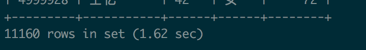
继续建B+索引在name上
	
	create index name_idx on orders(name);
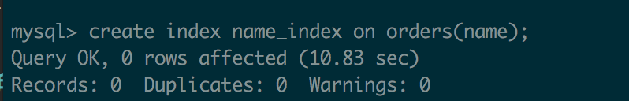
继续查询
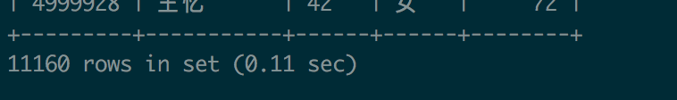
**效率大大增加**
	
	explain select * from orders where name like '王%';

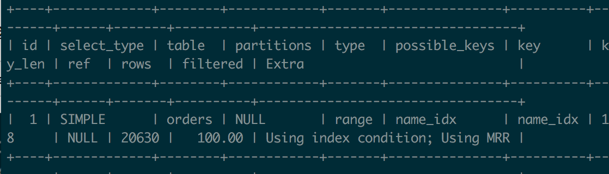
可以理解，因为名字集合本身很大，统计一下
		
	select count(distinct(name)) from orders;
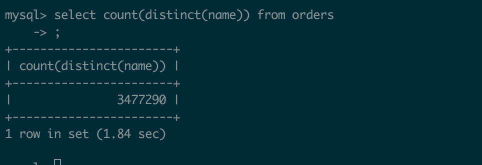
总: 3477290确实很巨大，考量表的其他列，名字的区分性确实让本身建立索引查询占优

**所以建索引**
### 问题3:统计 orders 表中所有男性的人的数量。
	select count(*) from orders where sex = '男';
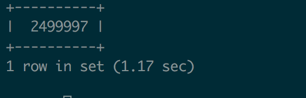

心里有数然而继续实践一下

	create index sex_idx on orders(sex);
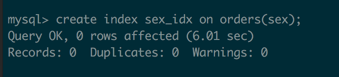

	select count(*) from orders where sex = '男';

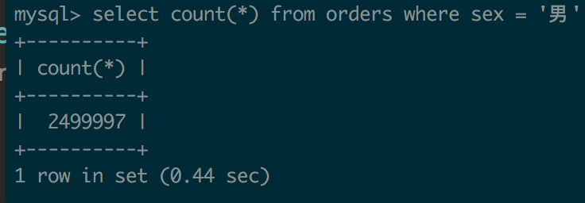

**因为是单纯计数而不需要访问本身，其索引建立的意义得到体现**
	
	explain select count(*) from orders where sex = '男';
	
**此时是索引查询**

**所以建索引**
### 问题4:在 orders 表中计算女性，姓张，年龄大于50，且消费小于100的人数。
	select count(*) from orders where sex = '女' and name like '张%' and age > 50 and amount < 100;
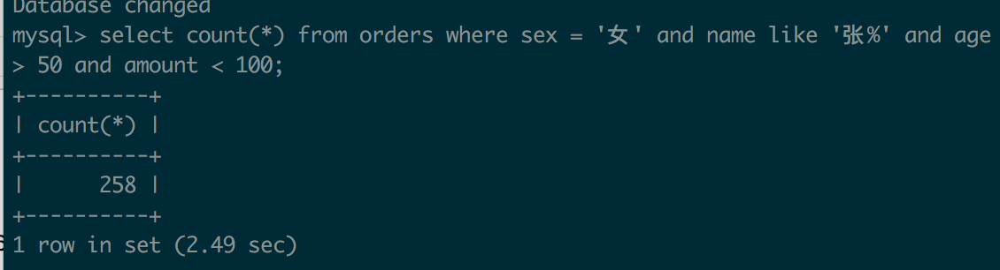
**沿用上面两题建立对sex, name, amount, age的复合索引而在计数不需要担心全部访问的尴尬**

	create index mul_idx on orders(sex, name, amount, age);
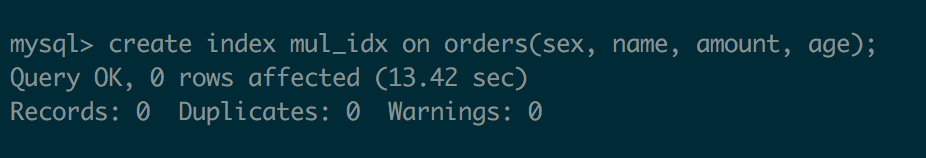
	
Once again

	select count(*) from orders where sex = '女' and name like '张%' and age > 50 and amount < 100;
	
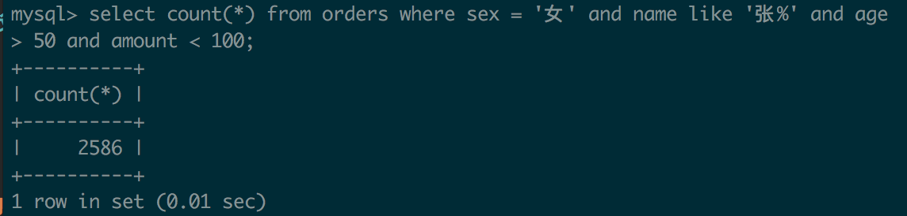

Stack Overflow对于复合列索引有一个类比电话本的解释我很喜欢，写一下:

1. 如果你找一个姓潘的人，你可以很容易找到因为电话本按姓排列
2. 如果你找一个名羽的人，那没办法了，因为电话本又链接不到名，你得查找全部😭
3. 如果你找一个姓潘名羽的肥宅，电话本会很有帮助，因为你能找到潘以后按名的顺序找到羽

以上解释了查找准确值，但是如果很不幸你想找**一个范围**，比如名是羽姓以p开头，这时候你得先找到那些名羽的人，只有先这样你才能group

我记下来的原因是因为这对理解复合列的索引很有帮助，**不要以为你做完了，你只是运气好吧sex放第一个，那么如果你运气不好呢，尝试一把**

	create index test_idx0 on orders(name, amount, age, sex);
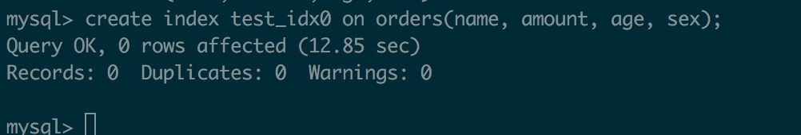

**忽略那些令人尴尬的warning，对multi-index都有数，MySQL还是选择了我第一把建的mul_index，这是有道理的**

	explain select count(*) from orders where sex = '女' and name like '张%' and age > 50 and amount < 100;
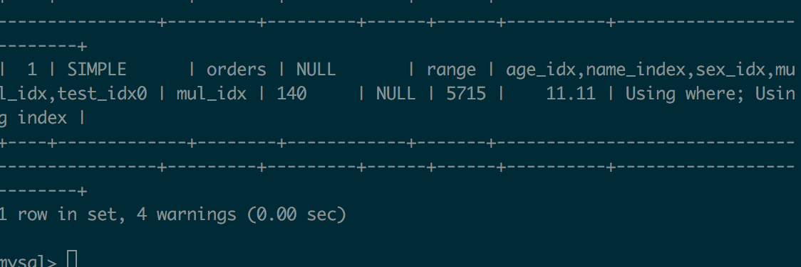

**此时心中应该规定优先级 exact > range > like**

**所以建索引**

### 问题5:统计 orders 表中姓名为三个字的人数。
	select count(*) from orders where name like '___';
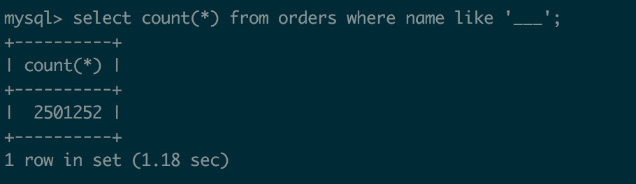
	
	create index name_idx on orders(name);
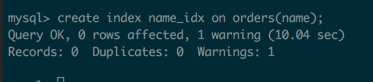

好了，这个索引好像**没用**
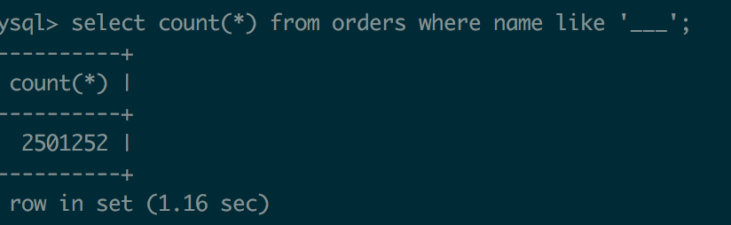
	
	explain select count(*) from orders where name like '___';
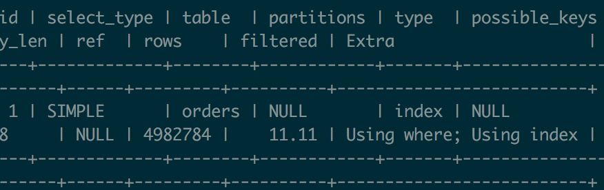
其实还是用了的，然而这个索引之所以没有提升也能理解，**索引本身的数量**决定了性能，而对于name列来说这本身就是一个巨大的挑战，MySQL拿出资源来维护索引本身也是**高昂的开销**

**所以建索引**

### 问题6:在 products 表中查找库存大于150的product列表。
	select * from products where nums>150;
	
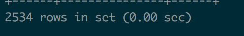
	其实我已经不想建索引了，0s我也看不出来，但没办法，Once again

	create index nums_idx on products(nums);
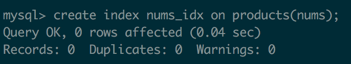
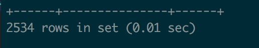

其实你**建了也没用**

	explain select * from products where nums>150;

还是那句话，索引本身是有代价的，MySQL会在资源和查询中作出权衡，具体视数据而定，这道题不应该建
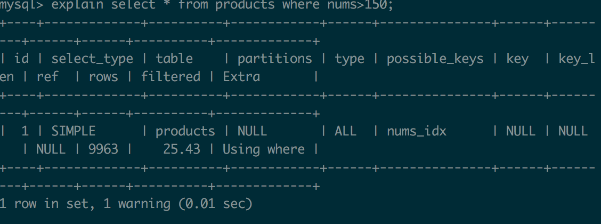
**所以不建索引**
	