# 数据库作业二说明
## 一个简单的命令行小工具
## ER图

## 操作及相关命令
### 增加用户

	add user [username] [password]
	e.g add user 陈振宇 123456

对应代码段: dao.UserDAO.addUser(String username, String password)方法

	
### 查询套餐

	search buddle [username]
	
	e.g: search buddle 陈振宇
对应代码段: dao.BuddleDAO.listBundleByUsername(String username)

### 订购套餐
#### 订购套餐并立即生效

		order imm [buddleType] [username] [period]
		
		e.g:  order imm call 陈振宇 2
		即用户陈振宇订购电话套餐2月并立即生效
对应代码段: dao.BuddleDAO.addBundleImmediately(BundleType bundleType, String username, int period)
#### 订购套餐并次月生效

		order next [buddleType] [username] [period]
		e.g: order next sms 陈振宇 3
		即用户陈振宇订购短信套餐3月并次月生效
对应代码段: dao.BuddleDAO.addBundleNextMonth(BundleType bundleType, String username, int period)

**规定套餐类型在命令行中的输入**

- call 电话套餐
- sms 短信套餐
- local 本地流量套餐
- dome 国内流量套餐

#### 退订套餐并立即生效

		deorder imm [username] [buddleId]
		
		e.g: deorder imm [刘嘉] [4]
		即用户刘嘉立即退订id为4的套餐

对应代码段: dao.BuddleDAO.removeBundleImmediately(String username, int buddleId)

#### 退订套餐并次月生效

		deorder next [username] [buddleId]
		
		e.g: deorder next [刘嘉] [5]
		即用户刘嘉退订id为4的套餐，次月生效

对应代码段: dao.BuddleDAO.removeBundleUntilNextMonth(String username, int buddleId)

### 资费生成

#### 通话

		fee call [username] [callUsage]
		
		e.g: fee call 陈振宇 10
		即用户陈振宇打了10分钟电话，显示话费费用和套餐提示
对应代码段: dao.ConsumptionDAO.addCallUsage(String username, double callUsage)
		

#### 短信
	
		fee sms [username] [SMSAmount]
		
		e.g: fee sms 刘嘉 20
		即用户刘嘉一次群发了20条短信，显示短信费用和套餐提示

对应代码段: dao.ConsumptionDAO.addSMSUsage(String username, int SMSAmount)

#### 本地流量
		
		fee local [username] [localDataUsage]
		
		e.g: fee local 陈振宇 500
		即用户陈振宇一次使用了500M本地流量，显示流量费用和套餐提示
对应代码段: dao.ConsumptionDAO.addLocalDataUsage(String username, double localDataUsage)

#### 国内流量 	

		fee dome[username] [domesticDataUsage]
		
		e.g: fee dome 刘嘉 800
		即用户刘嘉一次使用了800M流量，显示流量费用及套餐提示
对应代码段: dao.ConsumptionDAO.addDomesticDataUsage(String username, double domesticDataUsage)

### 生成账单

		bill [dateToMonth] [username]
		
		e.g: bill 2018-10 陈振宇
		即显示用户陈振宇在2018年10月的账单详细信息，包括电话、短信、流量的使用及套餐情况，账户话费及账户余额

 对应代码段: dao.BillDAO.addBill(String date, String username)
 
 
### 充值
	topup [username] [amount]
	
	e.g: topup 刘嘉 100
	即刘嘉充值100
 
 
## Demo
### 增加用户

	add user 潘羽 admin
	
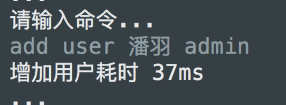

### 查询套餐
	
	search buddle 潘羽
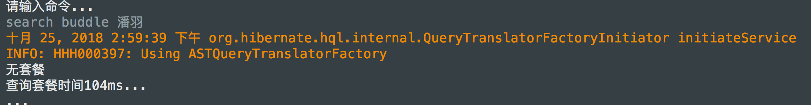

### 订购套餐(立即生效)

	order imm call 潘羽 1

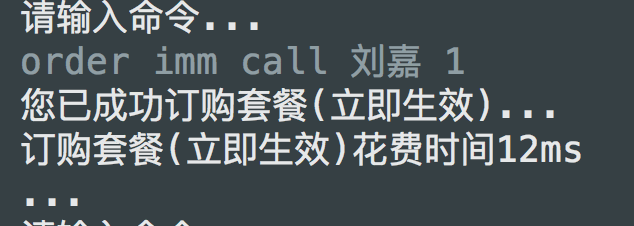

**此时查询用户潘羽的套餐信息**

	search buddle 潘羽

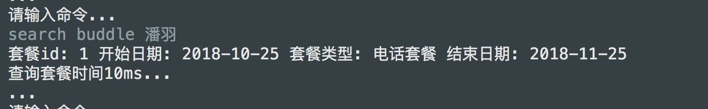
此时从当天(2018-10-25)订购一个月到2018-11-25

### 订购套餐(次月生效)

	order next sms 潘羽 2
	

**此时继续查询用户潘羽的套餐信息**
		
	search buddle 潘羽
	
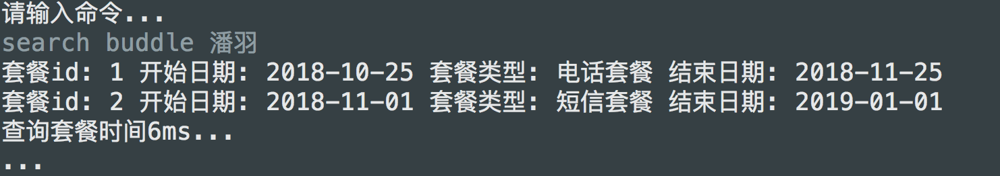
此时多了一个套餐是从下个月11-01开始到2019-01-01结束的

**此时查看一下用户的账户余额**

	check 潘羽
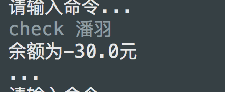

余额为初始0 - 20 - 0 = -20

###  移除套餐(立即生效)
	deorder imm 潘羽 1

查看用户潘羽此时只有套餐二
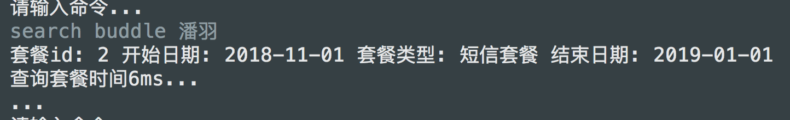
### 移除套餐(次月生效)
	deorder next 潘羽 2!
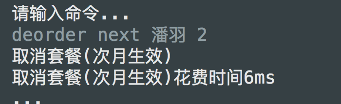
查看用户潘羽此时订单结束日期为2018-10-31
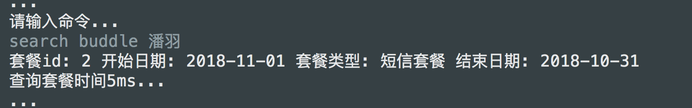

## 中间过程
**为了便于看出用户套餐对结果结果，我们增加用户刘嘉和陈振宇😝**
### 流程

1. 增加用户刘嘉，陈振宇，并为他们各充值1000元
2. 刘嘉订购电话套餐 * 1(1个月立即生效)，短信套餐 * 1(2个月立即生效)
3. 陈振宇订购本地流量套餐 * 1(2个月立即生效)，国内流量套餐 * 1 (3个月次月生效)
4. 刘嘉进行通话100分钟，一次群发了300条短信
5. 陈振宇使用本地流量100M，国际流量1G

### 命令执行段
		 add user 刘嘉 123456
		 add user 陈振宇 123456
		 topup 刘嘉 1000
		 topup 陈振宇 1000
		 order imm call 刘嘉 1
		 order imm sms 刘嘉 2
		 order imm local 陈振宇 1000
		 order next dome 陈振宇 3000
		 fee call 刘嘉 100
		 fee sms 刘嘉 300
		 fee local 陈振宇 100
		 fee dome 陈振宇 1000
		 bill 2018-10 刘嘉
		 bill 2018-10 陈振宇
		 
		 

### 实时电话费用生成

	fee call 刘嘉 100
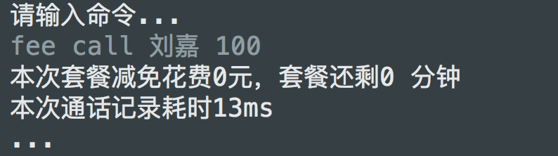
	
### 实时短信费用生成
	fee sms 刘嘉 300
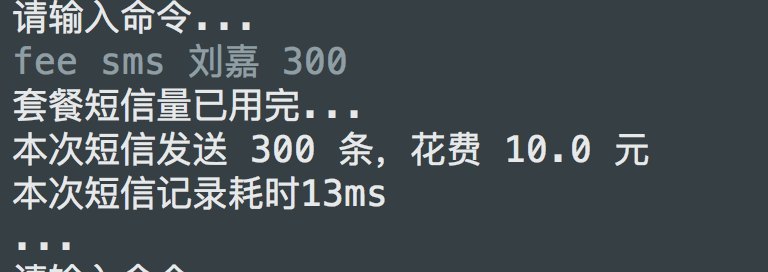
### 实时本地流量费用生成
	fee local 陈振宇 100
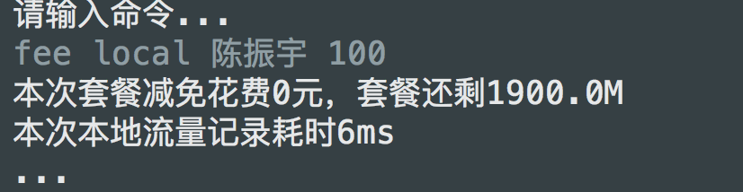
### 实时国内流量费用生成
	fee dome 陈振宇 1000
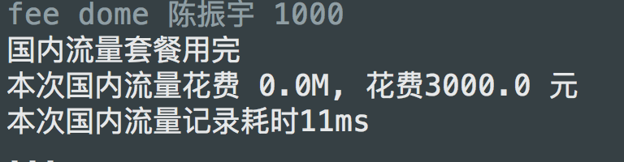
### 月账单生成
	bill 2018-10 刘嘉
	
1000 - 20 - 10 - (300 - 200) * 0.1 = 960
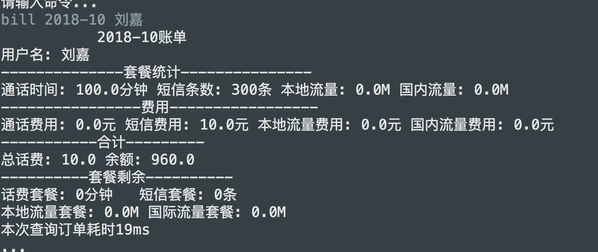

	 bill 2018-10 陈振宇
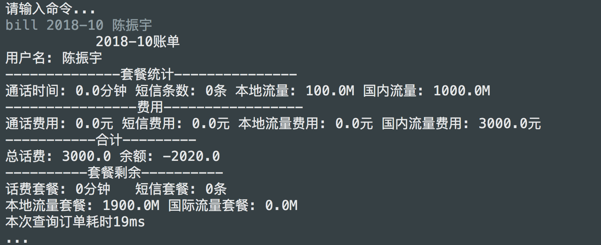

1000 - 20 - 0 - (1000 - 0) * 3 = -2020

🙄这种欠巨多的...

## 附加说明

